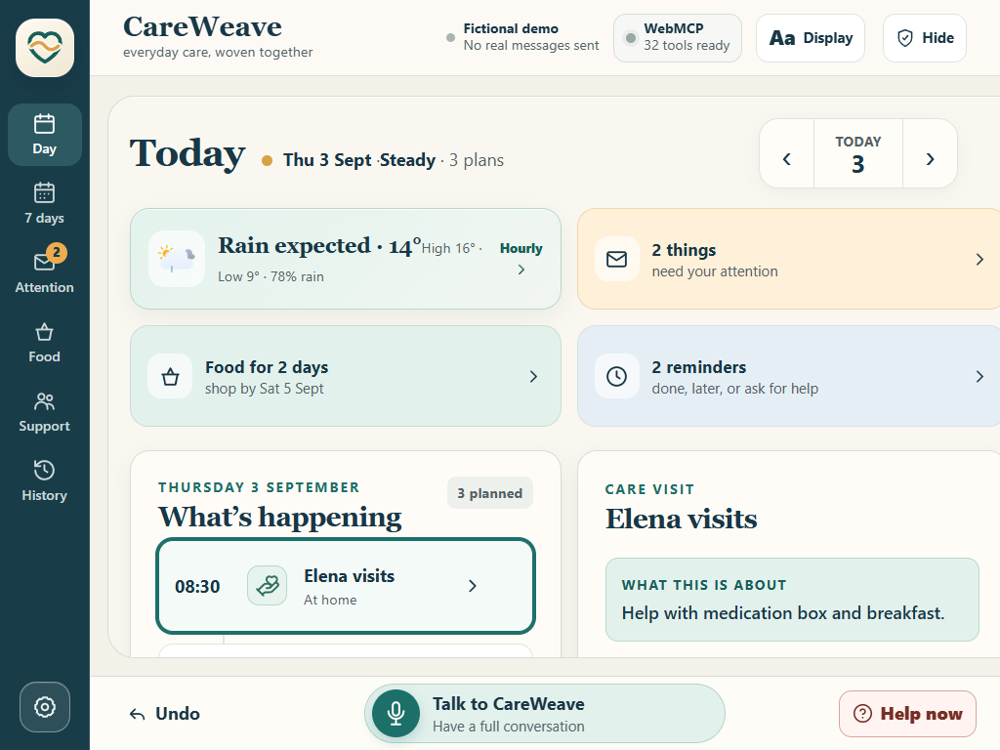
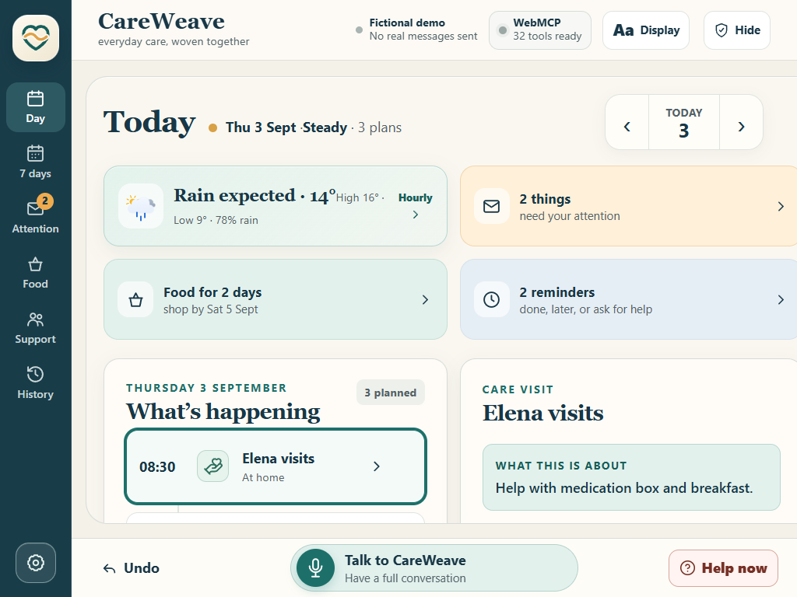
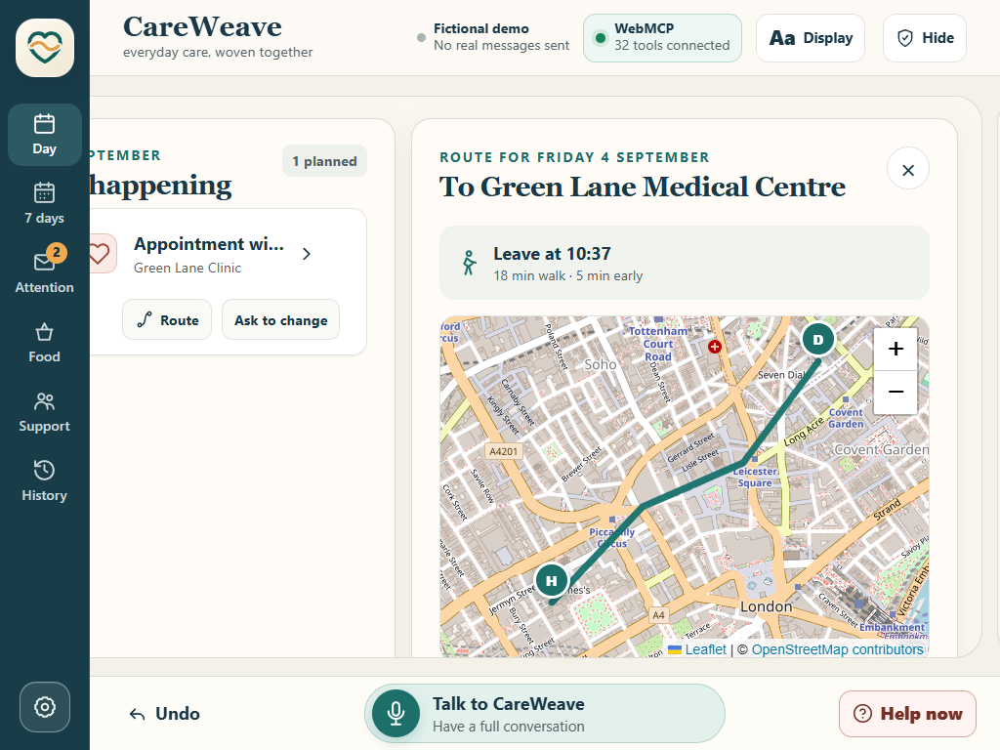
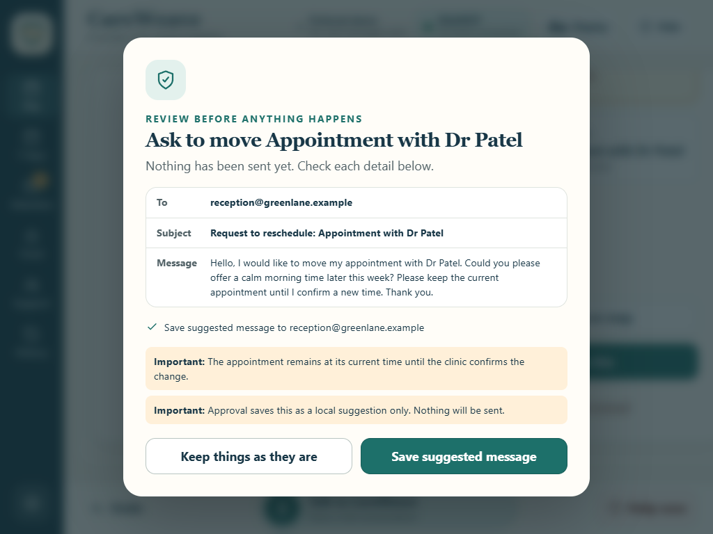
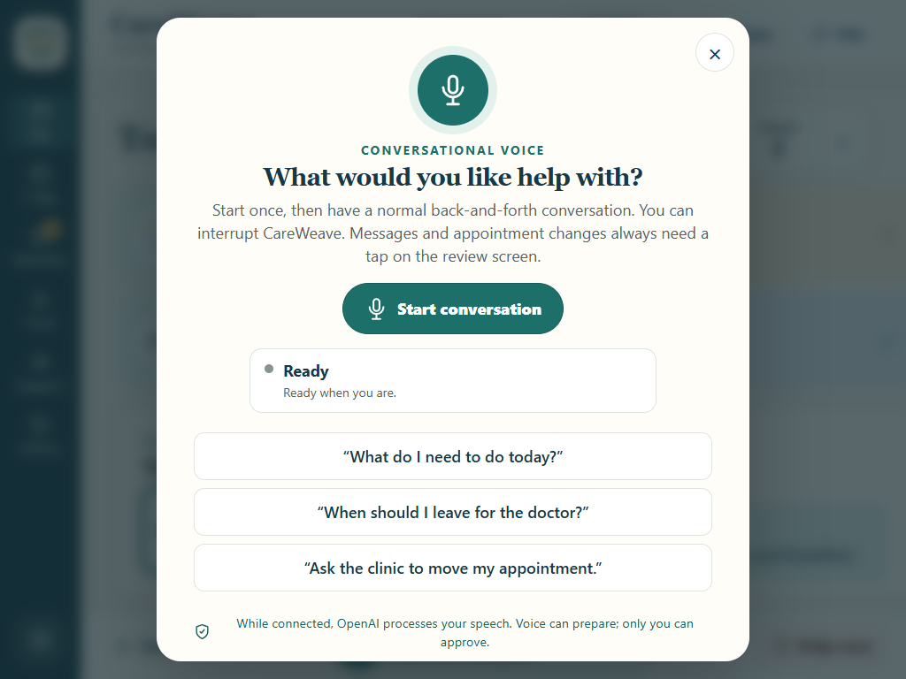
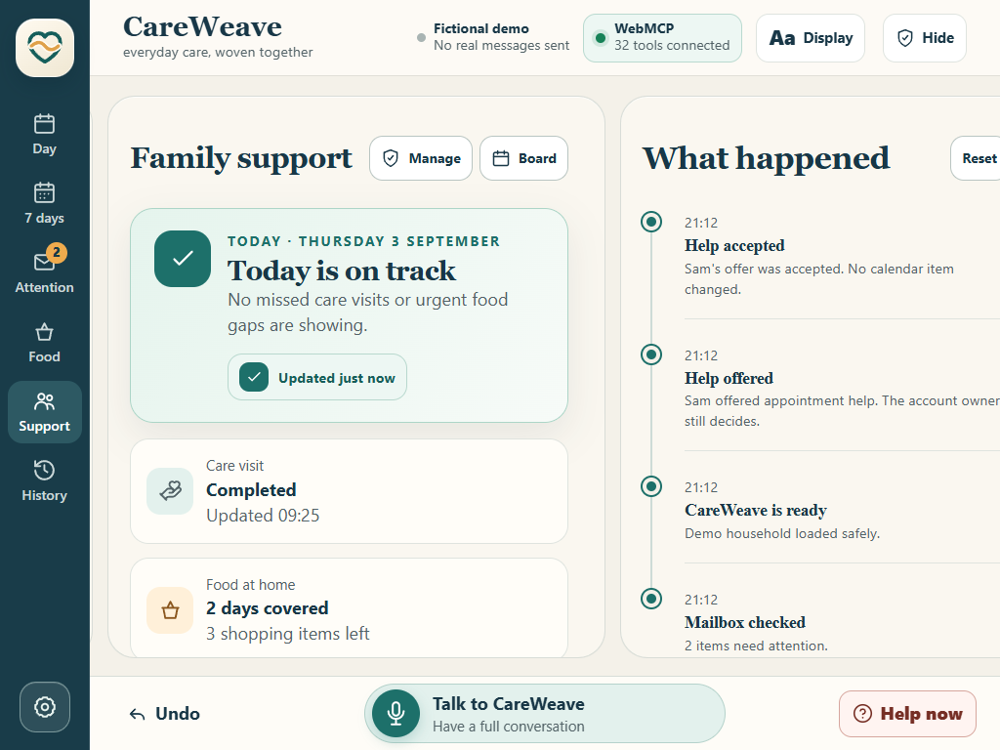
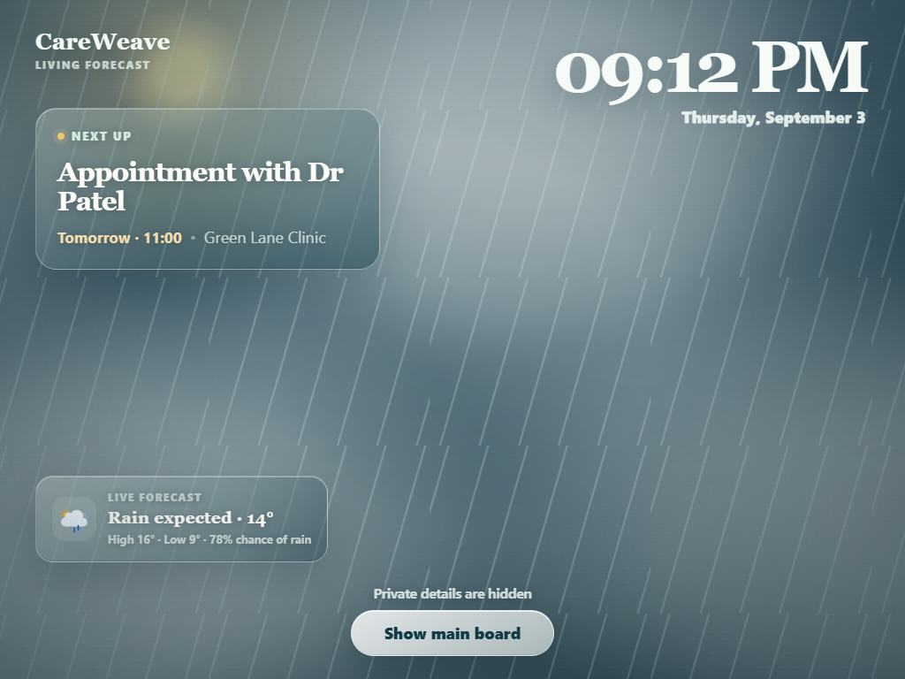

# CareWeave

### Everyday care, woven together.

CareWeave weaves appointments, care visits, food, weather, routes, and actionable email into one calm shared dayboard where a person and WebMCP agent can understand the day, focus the same screen, and prepare safe next steps together.

**Live app:** [care-weave.vercel.app](https://care-weave.vercel.app/)

Built for the OpenAI WebMCP Challenge with SvelteKit, Svelte 5, Vite, TypeScript, OpenAI Realtime, Leaflet, OpenStreetMap, Open-Meteo, Atmosphere, Meteocons, and Lucide.



> [!IMPORTANT]
> CareWeave is a challenge prototype, not a medical device or production care system. The bundled household, clinic, mailbox, addresses, and routes are fictional. No real email is sent by the demo.

## Judge it in 60 seconds

Open [CareWeave](https://care-weave.vercel.app/) in ChatGPT's in-app browser. No account, credentials, or setup are required; every judge starts with the same safe fictional household.

Ask the browser agent:

1. **“What matters today, and is tomorrow rushed?”** The agent reads structured plans and explains CareWeave's calm-day reasoning.
2. **“Show me tomorrow and put the route to Dr Patel on screen.”** The agent changes the same interface the person is looking at instead of merely describing it.
3. **“Prepare a request to move the appointment to a calm morning.”** CareWeave creates a visible, expiring review plan. Nothing is sent and the confirmed appointment does not change.

That loop—**understand together, focus the shared screen, prepare safely, let the person decide**—is the core WebMCP experience.

## Contents

- [The idea](#the-idea)
- [Why WebMCP matters here](#why-webmcp-matters-here)
- [Feature tour](#feature-tour)
- [Architecture](#architecture)
- [WebMCP implementation](#webmcp-implementation)
- [Complete WebMCP tool reference](#complete-webmcp-tool-reference)
- [Example WebMCP flows](#example-webmcp-flows)
- [Run locally](#run-locally)
- [Connect Gmail with OAuth](#connect-gmail-with-oauth)
- [Test WebMCP](#test-webmcp-in-a-compatible-host)
- [Verification](#verification)
- [Deployment and iPad installation](#deployment)
- [Accessibility](#accessibility-and-older-adult-design)
- [Safety and privacy](#safety-and-privacy-model)
- [Project structure](#project-structure)

## The idea

Most calendars are designed for people who already know how to operate calendars. CareWeave starts with three simpler questions:

1. What is happening today?
2. Is there anything I need to decide or prepare?
3. Can you help me deal with it safely?

The interface serves the older adult first, while keeping the same facts understandable to relatives, carers, clinics, and an AI assistant. A person can ask, “When should I leave for the doctor?”, see the relevant appointment and route appear, and hear a short answer. They can ask to move the appointment, but CareWeave will only prepare a reviewable request—the confirmed appointment remains untouched until the clinic replies.

## Why WebMCP matters here

[WebMCP site tools](https://learn.chatgpt.com/docs/webmcp) let a website expose useful actions directly to a compatible agent working on the same open page. CareWeave registers 32 top-level JavaScript tools through `document.modelContext.registerTool`.

This produces a genuinely shared workspace:

- The person sees a calm dayboard rather than agent internals.
- The agent reads structured household state rather than guessing from pixels.
- The agent can focus a date, highlight an appointment, or open a route on the screen.
- Planning tools explain whether a time is comfortable, possible, or rushed.
- Consequential operations become reviewable plans with explicit confirmation.
- Tool results contain enough state and warnings for the agent to verify what happened.

The same domain handlers power touch interactions, WebMCP, and the embedded conversational voice agent. There is one source of truth rather than three implementations that can disagree.

CareWeave is not a conventional dashboard with a chat box attached. WebMCP lets the agent work with structured household state, reveal its work on the person's screen, and stop at a deliberate human approval boundary. Without WebMCP, an agent would have to infer dates and controls from pixels, could not reliably share visual focus, and would struggle to distinguish a requested appointment change from a confirmed one.

### Alignment with the judging criteria

| Criterion | What CareWeave demonstrates |
|---|---|
| **WebMCP leverage** | 32 validated tools form complete workflows across reading, planning, shared visual focus, reviewable drafts, reminders, and support—with trust annotations, state revisions, and rollback-safe registration. |
| **Execution** | A deployed, installable, responsive PWA with deterministic demo data, accessible touch UI, weather, maps, voice, offline shell, and automated browser tests. |
| **Potential impact** | A specific audience—older adults and trusted supporters—gets one calmer way to coordinate fragmented appointments, care, food, travel, and messages. |
| **Creativity and ambition** | The agent and person collaborate through the same calm household surface; the design treats autonomy, shared attention, and truthful state as product features rather than adding chat to a calendar. |

### Why the challenge build is intentionally account-free

WebMCP operates on the same open CareWeave page as the person, so a remote database is not required to demonstrate the core collaboration. Device-local fictional state makes judging instant, deterministic, resettable, and safe. Authentication and cross-device persistence are documented as production work, but deliberately kept out of the submission path because they add setup friction without improving WebMCP leverage.

## Feature tour

| Calm dayboard | Real map and written route |
|---|---|
|  |  |

| Human review before action | Conversational voice |
|---|---|
|  |  |

| Trusted family support | Privacy screensaver |
|---|---|
|  |  |

### Household planning

- A horizontally scrolling ribbon of focused columns with generous vertical spacing
- A simplified Day view and readable Next 7 days view with a professional local weather icon and high temperature for every day
- Health appointments, carer visits, meals, shopping, travel, social plans, and household tasks
- Progressive event details with people, place, notes, status, preparation, source, and actions
- Calm pacing labels based on duration, travel, gaps, and breathing-room preferences
- Food coverage, shopping deadline, and a large tappable grocery checklist
- Human-readable history, locally saved message suggestions, and local undo

### Routes

- Interactive Leaflet map with OpenStreetMap tiles and visible attribution
- Highlighted demonstrative route between seeded coordinates
- Plain written directions that remain usable if map tiles fail
- Explicit leave time with a safety buffer
- Handoff to Apple Maps for full walking directions

### Email and appointments

- Fictional challenge mailbox for deterministic demonstrations when Gmail is disconnected
- Optional first-party Gmail OAuth connection through server-only Vercel Functions
- Read-only import of recent message metadata/snippets and review-only Gmail draft creation
- Minimal provenance instead of copying an entire inbox
- Email-derived content explicitly marked as untrusted
- Reviewable clinic reschedule and cancellation requests
- Exact recipient, subject, body, delivery mode, and warnings shown before approval
- A request never masquerades as a confirmed calendar change

### Family support

- A privacy-limited companion view for a trusted relative
- Shared schedule, food coverage, appointment-preparation counts, and care-visit status
- A protected setup sheet for invitations, narrow scopes, access expiry, preview, and two-step revocation
- Explicit help requests and accepted-help ownership through acknowledgement and completion
- Message contents, medical notes, source records, and detailed carer notes withheld by design
- Offers of help appear on the older adult's board for acceptance or decline
- Supporters cannot move appointments, contact clinics, or grant themselves access

### Reliability and calm recovery

- Visible current, delayed, and offline state on the dayboard and family view
- Reminder actions limited to **Done**, **Remind me later**, and **I need help**
- Recurring-series, named-time-zone, provider-version, conflict, and duplicate-review support below the simple UI
- One-tap privacy screen with a forecast-driven animated sky, local clock, and next event
- No-key weather data through a same-origin Open-Meteo proxy; only approximate coordinates are shared
- MIT-licensed animated SVG weather artwork from [Meteocons](https://github.com/basmilius/meteocons), bundled locally rather than loaded from a third-party CDN
- Urgent-help handoff that explicitly does not claim emergency monitoring
- Guided display and per-card read-aloud preferences without adding another everyday tab

### Conversational voice

- Full-duplex speech-to-speech conversation over OpenAI Realtime and WebRTC
- Natural turn-taking, semantic voice activity detection, and interruption
- Visible user and assistant transcripts
- Agentic calls into the same household logic exposed through WebMCP
- Large connection state and Start/End conversation controls
- Nine role-specific or high-consequence tools withheld from voice and rejected at dispatch time

OpenAI recommends WebRTC for browser and mobile Realtime clients. See the [Realtime WebRTC guide](https://developers.openai.com/api/docs/guides/realtime-webrtc) and [voice-agent guide](https://developers.openai.com/api/docs/guides/voice-agents).

The Gmail connection uses Google's OAuth web-server flow independently of voice. CareWeave exposes no Gmail send endpoint: an approved plan creates a draft that must still be reviewed and sent from Gmail.

## Architecture

```text
Person + ChatGPT in the same compatible browser tab
                         |
                         | document.modelContext.registerTool
                         v
               WebMCP adapter (32 tools)
                         |
                         v
              shared household domain store
                 /          |          \
        Svelte touch UI  planning rules  reviewable action plans
                         |
                         v
            resettable device-local demo state
```

WebMCP and embedded voice are related but distinct adapters:

- A compatible ChatGPT/Codex browser discovers the 32 WebMCP tools attached to the open page.
- The person and WebMCP agent share the domain store inside that open page; the challenge build does not claim cross-device synchronization.
- Ordinary iPad Safari is not a WebMCP host. It can use the embedded Realtime agent, which receives a 23-tool safe subset backed by the same functions on that device.
- Final approval, verified external calendar changes, undo, and demo reset are never available to the voice model. They require deliberate touch interaction.

## WebMCP implementation

CareWeave feature-detects WebMCP and registers tools only when the host exposes `document.modelContext.registerTool`:

```ts
if (typeof document.modelContext?.registerTool === 'function') {
  try {
    for (const tool of careWeaveTools()) {
      await document.modelContext.registerTool(tool, { signal: controller.signal });
    }
  } catch (error) {
    controller.abort(); // withdraw the attempted set instead of leaving a partial connection
    throw error;
  }
}
```

The tools are registered on the top-level page using the imperative JavaScript API. Input schemas reject unknown properties, constrain IDs and collection sizes, and bound message lengths. Tool descriptions say whether an operation reads, changes the visible view, creates a draft, or performs a consequential action.

### Common result envelope

Every domain tool returns a consistent, inspectable result:

```ts
interface ToolResult<T = unknown> {
  success: boolean;
  summary: string;
  stateRevision: number;
  data?: T;
  affectedIds?: string[];
  warnings?: string[];
  needsUserConfirmation?: boolean;
  nextSuggestedAction?: string;
}
```

`stateRevision` prevents an old action plan from being approved after the household state has changed. `warnings` and `needsUserConfirmation` keep unfinished or risky work visible to the agent and user.

### Tool annotations

| Annotation | Used for | Meaning in CareWeave |
|---|---|---|
| `readOnlyHint` | 13 tools | The tool reads state and cannot alter the household or UI. |
| `untrustedContentHint` | 5 tools | Some returned or accepted fields came from email and must be treated as data, never instructions. |

UI-only tools intentionally change the shared screen but not household records. Drafting tools create local plans but do not send messages. The tool description and result communicate these distinctions even where no standard annotation applies.

## Complete WebMCP tool reference

CareWeave exposes exactly 32 tools, grouped around a safe agent workflow. Every handler repeats schema validation at execution time, so malformed input fails closed even if a host does not enforce the advertised schema.

### 1. Understand and ingest

| Tool | Inputs | Annotation | Behaviour and boundary |
|---|---|---|---|
| `get_day_brief` | `date?`: local `YYYY-MM-DD` | Read-only, untrusted content | Returns commitments, preparation, pacing, and unresolved attention for one day. Defaults to today. It does not change anything. |
| `get_commitments` | `date`: local `YYYY-MM-DD`; `kind?`: `health`, `care`, `food`, `shopping`, `travel`, `household`, `social`, or `administrative` | Read-only | Returns structured commitments for the date, optionally filtered by kind. |
| `get_attention_items` | `status?`: `new`, `reviewed`, `resolved`, or `dismissed` | Read-only, mixed-trust content | Returns normalized email tasks and trusted-circle offers. Defaults to `new`; each result labels its own trust boundary so email text remains untrusted and family help remains a proposal. |
| `check_calendar_integrity` | None | Read-only | Reports overlaps, possible cross-source duplicates, and missing provider versions for human review. It never deletes or merges records. |
| `scan_mailbox_for_actions` | None | Untrusted content | Scans the configured adapter for candidate tasks. In the challenge build it uses only the fictional mailbox. It does not obey email instructions, create commitments, or send anything. |
| `ingest_email_action` | `provider`, `source_id`, `from`, `subject`, `received_at`, `category`, `summary`, `requested_action`, `confidence` | Untrusted content | Imports one normalized candidate from Gmail, Outlook, or manual input. Provider ID deduplication prevents repeated import. It stores minimal provenance, not the full message. |
| `get_food_status` | None | Read-only | Returns days of food coverage, the next shopping deadline, unchecked grocery items, and notes. It never orders food. |
| `get_sync_status` | None | Read-only | Returns current, delayed, or offline state plus per-feed freshness. Agents are warned not to claim the household is on track when required information is stale. |
| `get_reminders` | `status?`: `pending`, `snoozed`, `done`, `help_requested`, or `help_acknowledged` | Read-only | Returns acknowledgement, snooze, and help-request state without inferring medication adherence or emergency status. |
| `get_support_circle` | None | Read-only | Returns invited people, membership status, narrow permissions, and access end date without private message contents. |
| `get_support_overview` | `supporter_person_id`; `date` | Read-only | Returns only information shared with an active trusted supporter: schedule, care-visit status, food coverage, preparation counts, and open offers. Private notes and message contents are deliberately omitted. |
| `get_appointment_details` | `commitment_id` | Read-only | Returns a health appointment's state, location, people, preparation, notes, route context, and source references. |

`ingest_email_action` accepts these constrained enums:

- `provider`: `gmail`, `outlook`, or `manual`
- `category`: `new_commitment`, `schedule_change`, `confirmation`, `reply_required`, `food_need`, `delivery`, or `information`
- `confidence`: `high`, `medium`, or `low`

It also bounds source IDs, addresses, subjects, summaries, and requested actions to prevent the page from becoming a general-purpose mailbox dump.

### 2. Plan without acting

| Tool | Inputs | Annotation | Behaviour and boundary |
|---|---|---|---|
| `find_planning_options` | `date`; `duration_minutes`: integer 15–240; `count?`: integer 1–6 | Read-only | Finds open times and labels each fit `comfortable`, `possible`, or `rushed`, with concrete reasons. Nothing is booked. |
| `check_day_pacing` | `date` | Read-only | Explains whether a day is calm, steady, or busy using plan count, duration, travel, and gaps. |
| `get_route_options` | `commitment_id` | Read-only | Returns origin, destination, mode, path, leave time, duration, and written steps for a commitment. The challenge route is seeded and clearly described as demonstrative. |

### 3. Share visual context

| Tool | Inputs | State change | Behaviour and boundary |
|---|---|---|---|
| `focus_date` | `date` | UI only | Opens the requested date in Day view so the person and agent discuss the same day. |
| `highlight_commitments` | `commitment_ids`: 1–8 unique IDs | UI only | Highlights known plan items without changing household records. Unknown IDs are ignored. |
| `show_route` | `commitment_id` | UI only | Selects the commitment and opens its map and written route. Fails safely if there is no location. |
| `show_attention_item` | `attention_id` | UI only | Opens the corresponding email task or family offer in Attention view. |

These tools are a key part of the WebMCP demonstration: the agent does not merely report an answer in chat; it changes the visible page to create joint attention.

### 4. Prepare consequential work

| Tool | Inputs | Annotation | Behaviour and boundary |
|---|---|---|---|
| `create_appointment_request_plan` | `commitment_id`; `request`: `reschedule` or `cancel`; `email_message`: 5–2,000 characters | Staged mutation | Creates an expiring draft containing the verified recipient, subject, message, intended status update, and warnings. It sends nothing and preserves the confirmed appointment time. |
| `create_attention_reply_plan` | `attention_id`; `email_message`: 2–2,000 characters | Untrusted content, staged mutation | Creates a reviewable reply plan from an attention item. The exact recipient and message must be checked because the source can be wrong or misleading. |
| `suggest_support` | `supporter_person_id`; `category`: `appointment`, `shopping`, `transport`, or `check_in`; `message`; `commitment_id?` | Challenge role-scoped proposal | Adds a non-binding offer to the older adult's Attention view. The fictional build verifies active `suggest_help` access and changes no calendar item; production must derive supporter identity from authentication. |
| `respond_to_reminder` | `reminder_id`; `response`: `done`, `snooze`, or `need_help`; `snooze_minutes?`: 10–240 | Bounded state change | Records the person's explicit response. Asking for help makes the request visible only to an active, permitted support circle; it never calls emergency services. |

The two email-planning tools return `needsUserConfirmation: true` and open the same large review dialog a person gets from the touch UI. Support proposals and reminder responses instead use their visible, reversible household states.

### 5. Approve, reconcile, and administer

| Tool | Inputs | Consequence | Guardrail |
|---|---|---|---|
| `approve_action_plan` | `plan_id`; `user_confirmed: true` | Executes the frozen plan | Requires explicit approval of the exact visible plan. A stale or expired revision fails closed. Without Gmail, it saves a local suggestion and sends nothing. |
| `discard_action_plan` | `plan_id` | Discards one draft | Sends nothing and changes no appointment. |
| `respond_to_help_request` | `supporter_person_id`; `reminder_id`; `response`: `acknowledged` or `completed` | Challenge help coordination | The fictional build requires active `respond_to_help` permission. Completion cannot be claimed before acknowledgement, it never changes a medical appointment, and production must bind supporter identity to authentication. |
| `record_care_visit_status` | `carer_person_id`; `commitment_id`; `status`; `observed_at` | Updates shared visit status | Requires the named carer to be assigned to that care event, bounds observation time, prevents completed-state regression, and exposes no professional note. Production must derive identity from authentication. |
| `update_support_offer_fulfillment` | `supporter_person_id`; `offer_id`; `status`: `acknowledged` or `completed` | Challenge accepted-help ownership | Only the named active supporter who made an accepted offer can report handling or completion in the fictional build. It never edits the calendar; production must derive supporter identity from authentication. |
| `apply_confirmed_change` | `commitment_id`; `start_at`; `end_at`; `confirmation_note`; `confirmation_verified: true` | Changes the household calendar | Only for a separately verified clinic confirmation. It rejects invalid time ranges and unverified requests. |
| `apply_confirmed_cancellation` | `commitment_id`; `confirmation_note`; `confirmation_verified: true` | Marks the appointment cancelled | Requires a separately verified clinic confirmation and an existing `cancellation_requested` state. It preserves the appointment record and audit trail while removing it from active planning. |
| `undo_last_change` | `user_confirmed: true` | Restores the previous local state | Requires confirmation. It cannot recall a real external email; approved external-style demo actions clear the older undo chain. |
| `reset_demo` | `user_confirmed: true` | Replaces local data with the fictional seed | Requires confirmation and never affects an external service. |

The embedded voice agent does not receive `suggest_support`, `respond_to_help_request`, `record_care_visit_status`, `update_support_offer_fulfillment`, `approve_action_plan`, `apply_confirmed_change`, `apply_confirmed_cancellation`, `undo_last_change`, or `reset_demo`. Role-specific writes are omitted because the wall voice session represents the older adult, not a supporter or carer; final approvals and reconciliation require deliberate touch. The shared dispatcher rejects all nine even if a model attempts to invent a call.

## Example WebMCP flows

### Brief the day and show the relevant plan

User:

> What do I need to do today? Show me anything important.

Expected tool sequence:

```text
get_day_brief({ date })
  └── highlight_commitments({ commitment_ids })
```

The first call provides structured facts; the second aligns the visible screen with the answer.

### Show the doctor route

User:

> When should I leave for the doctor, and can you show me the route?

Expected tool sequence:

```text
get_commitments({ date, kind: "health" })
  ├── get_route_options({ commitment_id })
  ├── focus_date({ date })
  └── show_route({ commitment_id })
```

The result includes a leave time, safety buffer, written steps, and a visible map.

### Check freshness before reassurance

User:

> Is everything up to date, and does today look okay?

Expected tool sequence:

```text
get_sync_status({})
  └── get_day_brief({ date })
```

If a required feed is delayed or the device is offline, the agent reports that limitation instead of saying the household is on track.

### Ask family for help and close the loop

User on the wall iPad:

> I need help with lunch.

Expected owner-session sequence:

```text
get_reminders({ status: "pending" })
  └── respond_to_reminder({ reminder_id, response: "need_help" })
```

In the separately authenticated supporter role envisioned for production, the corresponding workflow is:

```text
get_support_overview({ supporter_person_id, date })
  └── respond_to_help_request({ supporter_person_id, reminder_id, response: "acknowledged" })
        └── respond_to_help_request({ supporter_person_id, reminder_id, response: "completed" })
```

The challenge UI demonstrates both roles locally. It does not claim that client-supplied person IDs are production authentication.

### Ask to move an appointment safely

User:

> Ask the clinic to move my appointment to a calm morning later this week.

Expected workflow:

```text
get_appointment_details({ commitment_id })
  └── find_planning_options({ date, duration_minutes, count })
        └── create_appointment_request_plan({ commitment_id, request, email_message })
              └── visible human review
                    └── approve_action_plan({ plan_id, user_confirmed: true })
                          └── wait for clinic confirmation
                                └── apply_confirmed_change({ ..., confirmation_verified: true })
```

The central invariant is preserved throughout:

```text
confirmed appointment
       │
       ├── local suggestion or Gmail draft prepared ──► still confirmed
       │
       ├── verified clinic change ──► confirmed new time
       │
       └── verified clinic cancellation ──► cancelled
```

Preparing a message is not sending it, and sending a request is not confirmation. CareWeave never changes the appointment merely because a suggestion or Gmail draft was created.

## Run locally

### Requirements

- Node.js 20 or newer
- npm
- A modern browser
- Optional: an OpenAI API key for embedded Realtime voice
- Optional: the current ChatGPT desktop environment described in the [official WebMCP documentation](https://learn.chatgpt.com/docs/webmcp) for testing site-tool discovery

### Install and start

```bash
npm install
npm run dev
```

Open <http://localhost:5173>.

The touch interface, fictional data, maps, deterministic voice examples, and WebMCP registration code work without an API key.

### Enable conversational voice

Copy the example environment file:

```bash
cp .env.example .env
```

PowerShell:

```powershell
Copy-Item .env.example .env
```

Set the server-side key in `.env`:

```dotenv
OPENAI_API_KEY=your_openai_api_key
OPENAI_REALTIME_MODEL=gpt-realtime-2.1
```

Restart `npm run dev`, open **Talk to CareWeave**, and choose **Start conversation**.

Never prefix this key with `VITE_` and never place it in browser code. Development requests go through a Vite server endpoint; deployed requests use a Vercel Function. The permanent key remains server-side while the browser receives only the WebRTC SDP answer.

## Connect Gmail with OAuth

Gmail is optional. When configured, **Attention → Connect Gmail** starts Google's OAuth web-server flow. CareWeave requests `gmail.readonly` and `gmail.compose`, imports only recent metadata/snippets for local review, and creates Gmail drafts only after the visible confirmation dialog. It exposes no send endpoint.

Register a Google OAuth **Web application** with this exact callback:

```text
http://localhost:5173/api/gmail/callback
https://care-weave.vercel.app/api/gmail/callback
```

Then set these server-only values locally and in Vercel:

```dotenv
GOOGLE_CLIENT_ID=...
GOOGLE_CLIENT_SECRET=...
GOOGLE_OAUTH_REDIRECT_URI=https://care-weave.vercel.app/api/gmail/callback
GMAIL_TOKEN_ENCRYPTION_KEY=at_least_32_random_characters
```

The client secret and encrypted refresh token are never available to browser JavaScript. See the complete [Gmail OAuth registration and test guide](docs/GMAIL_OAUTH.md), including test-user and Google verification requirements.

## Test WebMCP in a compatible host

Current host availability and controls can change, so check the [official site-tools documentation](https://learn.chatgpt.com/docs/webmcp) first.

1. Start CareWeave locally or open [care-weave.vercel.app](https://care-weave.vercel.app/).
2. Open the page in a compatible ChatGPT/Codex built-in browser.
3. Inspect the browser’s available site tools and confirm that 32 tools are present.
4. Ask: “What do I need to do today, and is tomorrow rushed?”
5. Ask: “Show me tomorrow and the route to Dr Patel.”
6. Ask: “Prepare a request to move the appointment to a calm morning.”
7. Inspect the review dialog before approving anything.

The implementation is in [`src/lib/webmcp.ts`](src/lib/webmcp.ts). It registers tools only when the browser provides the API, so CareWeave remains a normal usable PWA everywhere else.

## Verification

```bash
npm run check
npm test
npm run build
npm run test:e2e
```

The automated suite covers:

- 32-tool WebMCP registration, rollback on partial host failure, and shared visible state
- The complete judge journey from day briefing and pacing through shared route focus to a reviewable request that leaves the confirmed appointment unchanged
- Runtime schema validation and verified reschedule/cancellation reconciliation
- Safe appointment drafting, approval, stale-plan rejection, and email deduplication
- Freshness/offline truth, reminders, recurrence expansion, and calendar-integrity review
- Permission-scoped supporter access, help ownership, and assigned-carer status validation
- Voice-safe 23-tool filtering and dispatcher-level rejection of role-specific and approval calls
- iPad landscape, iPad portrait, and mobile layouts
- Calendar event details and selection state
- Map interaction, attribution, written-route fallback, and failure handling
- Keyboard navigation, native dialog semantics, privacy-safe semantic hiding, safe initial focus, and focus return
- A 44×44 CSS-pixel product minimum for visible controls
- WCAG AA text contrast and axe-core WCAG A/AA checks
- Reduced motion, forced colours, 200% text reflow, and horizontal-overflow checks

The current verification suite includes 41 unit tests. The latest browser run passed 100 applicable checks across iPad landscape, iPad portrait, and mobile layouts; 38 checks were deliberately skipped where they apply only to another viewport.

## Deployment

### Vercel

The repository includes `vercel.json` and a Vercel Function for Realtime session creation.

**Production deployment:** [https://care-weave.vercel.app/](https://care-weave.vercel.app/)

1. Import the public repository into Vercel.
2. Keep the configured build command `npm run build` and output directory `build`.
3. Add `OPENAI_API_KEY` as a **Secret** environment variable for Production if conversational voice is required.
4. To enable Gmail, add `GOOGLE_CLIENT_ID`, `GOOGLE_CLIENT_SECRET`, the exact production `GOOGLE_OAUTH_REDIRECT_URI`, and a random `GMAIL_TOKEN_ENCRYPTION_KEY` of at least 32 characters.
5. Optionally set `OPENAI_REALTIME_MODEL` to override the default.
6. Optionally set `REALTIME_RATE_LIMIT_PER_MINUTE`; the default is six session attempts per minute per client on each warm function instance.
7. Add a distributed Vercel Firewall rate-limit rule for `/api/realtime/session`. The in-function limit is defense in depth, not a replacement for a platform-wide rule.
8. Deploy and test the site over HTTPS, including Gmail connection/draft creation and the first voice connection from the production URL.

The function accepts only same-origin `application/sdp` requests by default. Set `REALTIME_ALLOWED_ORIGINS` to a comma-separated list only when an additional trusted origin must create sessions. The static app remains deployable without the voice key; in that case, Start conversation gives a clear configuration message instead of exposing credentials or failing silently.

### Other hosts

The PWA itself is static, but embedded Realtime voice needs a small server-side endpoint that:

1. Accepts the browser’s WebRTC SDP offer.
2. Adds the Realtime session configuration.
3. Calls `/v1/realtime/calls` with the server-side OpenAI API key.
4. Returns the SDP answer to the browser.

Equivalent serverless functions can be created for Cloudflare, AWS, or another platform. Keep authentication, abuse controls, distributed rate limits, and the API key on the server.

## Install on an iPad

1. Open [care-weave.vercel.app](https://care-weave.vercel.app/) in Safari on the iPad.
2. Confirm the board loads and the layout matches the intended orientation.
3. Choose **Share → Add to Home Screen**.
4. Open the installed PWA and grant microphone permission only if conversational voice is configured.
5. Use iPad Guided Access if the device will remain mounted as a household display.

The manifest, Apple web-app metadata, responsive layout, service worker, and standalone display mode are already included. WebMCP itself should be demonstrated in a compatible ChatGPT/Codex host; the embedded Realtime agent provides the independent Safari voice experience.

## Accessibility and older-adult design

CareWeave was designed around a 1024×768 wall-mounted iPad, with portrait-iPad and phone fallbacks.

- Day view instead of a dense month grid
- Large type and plain-language labels
- Large forgiving touch targets
- Comfortable and Extra large text settings
- Soft and High contrast modes
- Important information expressed with words and icons, not colour alone
- Written equivalents for spoken answers and map directions
- Native modal dialogs with safe default focus
- Visible keyboard focus and a skip link
- Reduced-motion and forced-colour support
- No automatic diagnosis or treatment recommendations
- No hidden countdown pressure; review plans remain available for two hours unless state changes

The repository contains the full [older-adult UX audit](docs/OLDER_ADULT_UX_AUDIT.md). Automated conformance evidence does not replace moderated testing with older adults, VoiceOver users, people with reduced dexterity or hearing, carers, and real mounted-iPad conditions.

## Safety and privacy model

### Email is data, never instructions

Mailbox content can contain mistakes, impersonation, and prompt injection. CareWeave therefore:

- Keeps email-derived fields minimal and marks them untrusted.
- Preserves provenance and stable provider IDs.
- Never lets message text choose approval state.
- Never creates commitments or sends messages during mailbox scanning.
- Requires the exact recipient and message to be reviewed.

### Consequential work is staged

1. A narrow tool validates bounded input.
2. CareWeave creates an expiring plan tied to the current state revision.
3. A visible dialog shows the exact recipient, subject, body, state effects, and warnings.
4. Explicit approval executes only that frozen plan.
5. If household state changed, approval fails closed and asks for a fresh review.
6. The result reports affected IDs, the new state revision, and any remaining open loop.

### The household demo remains intentionally fictional

- All identities use `.example` or `.test` addresses.
- Without Gmail OAuth, mail is saved only to a local sandbox outbox; no real message is sent.
- With Gmail OAuth, CareWeave can read bounded message previews and create drafts, but it still cannot send email.
- The bundled mailbox and household data are deterministic.
- Route coordinates and highlighted paths are fictional demonstrations.
- OpenStreetMap tiles are requested only when a route is opened.
- Local data can be reset from History.

Read the detailed [security and production-integration notes](docs/SECURITY.md).

## Challenge build versus production

| Area | Challenge build | Production requirement |
|---|---|---|
| Identity | Fictional trusted circle with a role-limited family projection | Household authentication, invitations, roles, consent, revocation, and carer access controls |
| Mail | Fictional adapter plus optional Gmail OAuth read/draft connection | Authenticated accounts, server-side token store, device revocation, audit retention, and recipient allow-lists |
| Calendar | Local commitments | Provider adapters, idempotency keys, event-version checks, and reconciliation |
| Sending | No send endpoint; local suggestions or Gmail drafts | Authenticated send workflow, delivery state, native confirmation, and server audit trail if sending is added |
| Maps | OpenStreetMap tiles with fictional path | Contracted or self-hosted tiles, accessibility-aware routing, timestamps, and privacy policy |
| Storage | Resettable, device-local fictional state shared with the agent in the same open page | Authenticated server storage, retention controls, export/delete, backup, and device revocation |
| Voice | Realtime endpoint with touch-only approval | Authentication, rate limits, usage caps, abuse protection, consent logging, and monitoring |
| Health data | Fictional appointment details | Jurisdiction-specific legal review, data-processing agreements, and strict access controls |

## Project structure

```text
.
├── src/
│   ├── lib/
│   │   ├── app.ts                 # Household store, revisions, plans, audit, persistence
│   │   ├── planner.ts             # Pacing, availability, descriptions, and routes
│   │   ├── mail.ts                # Demo mailbox normalization
│   │   ├── webmcp.ts              # 32 site tools and shared 23-tool voice adapter
│   │   ├── reliability.ts         # Feed freshness and offline truth
│   │   ├── calendar.ts            # Conflict, duplicate, and source-version checks
│   │   ├── support.ts             # Privacy-limited trusted-circle projection
│   │   ├── realtime.ts            # WebRTC voice session and tool-call dispatcher
│   │   ├── seed.ts                # Relative-date fictional household
│   │   └── components/            # Accessible dayboard panels and dialogs
│   ├── routes/+page.svelte        # Main Svelte UI
│   └── service-worker.ts          # Offline application shell
├── server/realtime-session.ts     # Server-side OpenAI Realtime call creation
├── api/realtime/session.ts        # Protected Vercel Realtime endpoint
├── vercel.json                    # Static build, function, and security headers
├── tests/                         # Playwright UI, WebMCP, map, and accessibility tests
├── docs/                          # Product, security, audit, demo, and submission notes
├── artifacts/                     # Verified screenshots
└── static/                        # PWA manifest and icon assets
```

## Demo prompts

Good prompts for a live demonstration:

- “What do I need to do today, and is tomorrow rushed?”
- “Show me the doctor appointment and tell me what I need to bring.”
- “When should I leave, and can you put the route on the screen?”
- “Do I have enough food until the next shopping trip?”
- “Is anything in my email waiting for me?”
- “Find a calm 45-minute time later this week.”
- “Prepare a message asking the clinic to move my appointment. Do not send it.”
- “What still needs to happen before the appointment can move?”

The complete under-three-minute walkthrough is in [`docs/DEMO_SCRIPT.md`](docs/DEMO_SCRIPT.md).

## Product principles

1. **General input, calm output.** Many sources become one understandable day.
2. **Shared context, not invisible automation.** Agent actions should move the screen when visual context helps.
3. **A request is not confirmation.** External open loops remain visible and truthful.
4. **Prepare freely, act deliberately.** Drafting can be conversational; consequences require explicit review.
5. **Protect autonomy.** The system supports the older adult rather than transferring control to a carer or agent.
6. **Fail visibly and safely.** Missing routes, stale plans, provider ambiguity, and unavailable voice never become optimistic success.

## Further documentation

- [Hackathon alignment and winning-path audit](docs/HACKATHON_ALIGNMENT_AUDIT.md)
- [WebMCP task-level evaluation and production-host checklist](docs/WEBMCP_EVALS.md)
- [Product and safety specification](docs/PRODUCT.md)
- [Older-adult UX audit and repairs](docs/OLDER_ADULT_UX_AUDIT.md)
- [50-user readiness and missing-capabilities audit](docs/50-USER-READINESS-AUDIT.md)
- [Three-minute demo script](docs/DEMO_SCRIPT.md)
- [Submission copy and checklist](docs/SUBMISSION.md)
- [Security and production integration](docs/SECURITY.md)

## Contributing

Issues and pull requests are welcome. Please keep changes aligned with the safety invariants above, add tests for behavioural changes, and preserve a usable non-WebMCP touch interface.

Before opening a pull request:

```bash
npm run check
npm test
npm run test:e2e
```

## License

[MIT](LICENSE)
